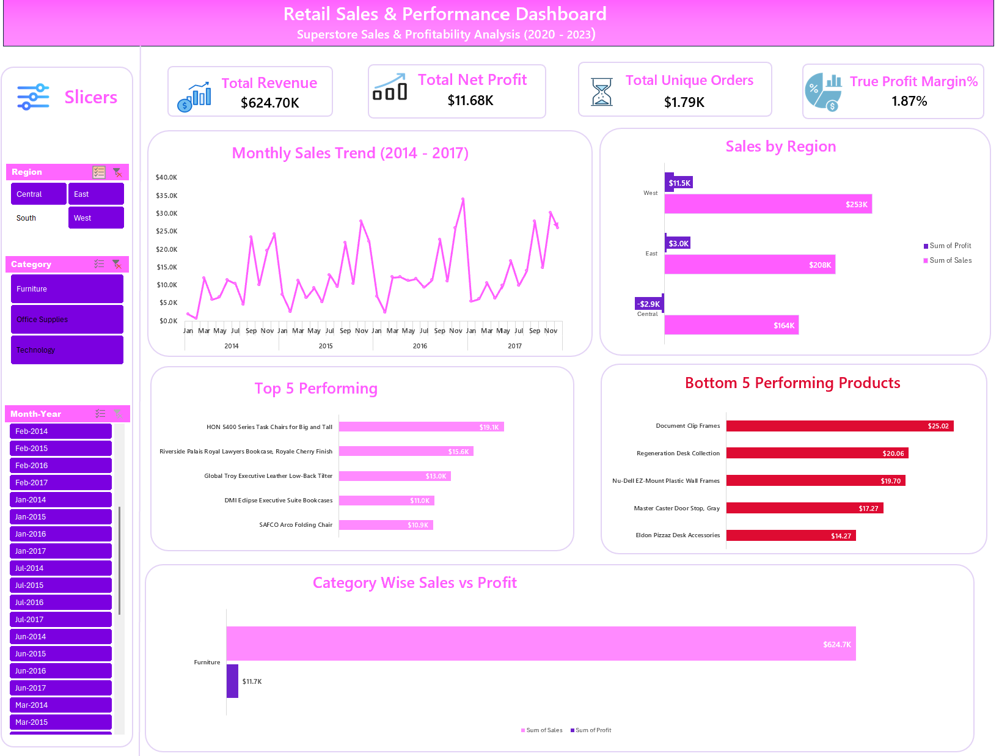

# 🛒 Retail Sales & Performance Analysis (Superstore Dataset)


## 📌 Project Overview
This project presents an end-to-end data analytics and visualization solution for a retail superstore. Using historical sales data (2014–2017), an interactive executive dashboard was constructed in Microsoft Excel to evaluate revenue trends, profitability drivers, regional performance, and product performance metrics.

---

## 🧹 Data Cleaning & Preprocessing Procedure
Before building Pivot Tables and visualizations, the raw dataset underwent rigorous data auditing and cleaning in Excel:

1. **Duplicate Check:** Verified and removed duplicate rows using Excel's **Remove Duplicates** feature on `Order ID` + `Product ID` combinations.
2. **Data Types & Formatting:**
   - Converted `Order Date` and `Ship Date` into standard Date formats (`YYYY-MM-DD`).
   - Standardized `Sales` and `Profit` columns into Currency format (`$`).
3. **Missing Values Handling:** Checked for `NULL` / blank entries across key attributes (`Category`, `Region`, `Sales`, `Profit`). No critical missing numerical values were found.
4. **Calculated Columns Added:**
   - **Profit Margin %:** Calculated as `[Profit] / [Sales]`.
   - **Month-Year:** Extracted using `=TEXT(Order Date, "mmm-yyyy")` for chronological timeline analysis.

---

## 📊 Key Dashboard Features
The interactive dashboard provides high-level executive KPIs alongside granular visual breakdowns:

- **KPI Metric Cards:** Displays Total Revenue ($2.30M), Total Net Profit ($286.40K), Total Unique Orders (9.99K), and Overall Profit Margin (12.47%).
- **Monthly Sales Trend Line Chart:** Tracks revenue seasonality and performance growth from 2014 through 2017.
- **Regional Sales & Profit Bar Chart:** Highlights revenue and profit distributions across West, East, South, and Central territories.
- **Top 5 & Bottom 5 Product Bar Charts:** Identifies key revenue drivers (e.g., Canon Copiers) versus micro-value / underperforming products.
- **Category Sales vs. Profit Clustered Bar Chart:** Compares Furniture, Office Supplies, and Technology side-by-side.
- **Dynamic Slicers:** Allows instant filtering by Region, Category, and Timeline.

---

## 📸 Dashboard Preview

### 1. Main Dashboard View


### 2. Interactive Filtered View


---

## 💡 Key Business Insights

1. **Technology Dominance:** Technology drives the highest revenue ($836.2K) and profit ($145.5K) with a strong ~17.4% profit margin.
2. **Furniture Profitability Leakage:** Furniture generates significant gross sales ($742.0K) but suffers from a weak net profit margin (~2.5%) due to heavy shipping costs and discounting.
3. **Regional High-Performer:** The **West Region** leads the business ($725K Sales / $108.4K Profit), whereas the **Central Region** shows underperformance relative to its sales volume.
4. **Q4 Seasonality:** Clear spike in sales observed every Q4 (October–December), peaking in late 2017 at ~$120K/month.

---

## 🛠️ Tools Used
- **Data Processing & Analytics:** Microsoft Excel (Pivot Tables, Calculated Fields, Advanced Formulas)
- **Data Visualization:** Excel Dynamic Charts, Custom Color Themes, Slicers
- **Documentation:** Markdown & MS Word

---
## 📁 Repository Structure

```text
.
├── Week1_Retail_Sales_Analysis.xlsx   # Main Excel Workbook (Data + Pivots + Dashboard)
├── Retail_Sales_Insights_Report.pdf   # Executive Summary Report
├── Dashboard_Overview.png             # Primary Dashboard Screenshot
├── Dashboard_Filtered_View.png        # Slicer Filtered Screenshot
└── README.md                          # Project Documentation
```
